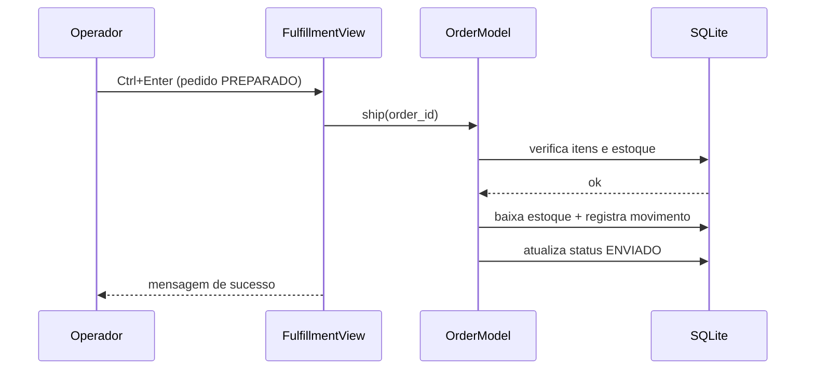

# 01 — Arquitetura

Camadas e papéis

- Views (Tkinter): recebem eventos, validam entrada básica, chamam Models e atualizam a UI.
- Models: regras de negócio, cálculos e persistência (usam `db.py`).
- DB (`db.py`): conexão SQLite, criação de tabelas e migrações idempotentes.
- Utils: formatação, exportação, geração de IDs e tempo.

Fluxo “Fazer uma venda” (Flowchart)

```mermaid
flowchart TD
  A[Usuário adiciona itens na Tela de Vendas] --> B[Click Finalizar (F5)]
  B --> C[SalesView._finalize]
  C --> D[SaleModel.create_sale]
  D --> E[Grava em sales/sale_items]
  E --> F[Criar Order (OrderModel.create)]
  F --> G[Pedido 'AGUARDANDO']
  G --> H[SalesView abre aba Pedidos]
```

Fluxo “Enviar pedido” (Sequence)



Dependências entre módulos

- `views/*` importam seus `models/*` e utilitários (formatting/exports).
- `models/*` importam `db.py` e utilitários (`ids`, `time`).
- `db.py` é independente (só usa stdlib) e é usado por todos.
